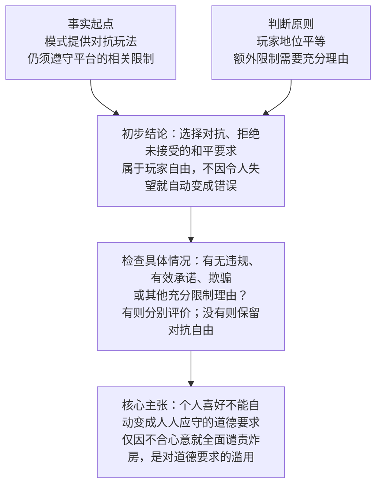
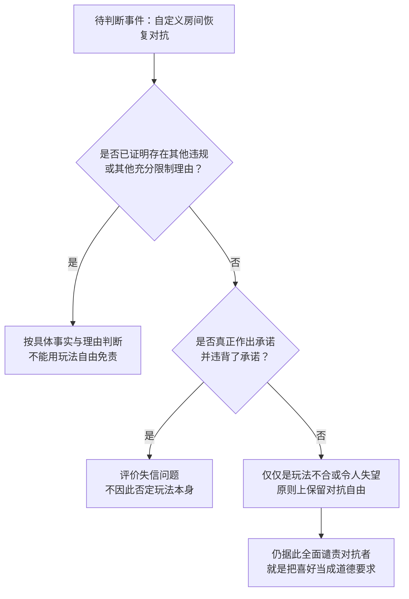

# 私人约定的边界与对抗自由——《第五人格》自定义“炸房”的玩法正当性

“佛房”争议的核心，是谁有资格决定这一局应当怎么玩。

**Cherry Z.**1 · **ChatGPT 6 Astra**2

1 Arasaka Tower, Corpo Plaza, City Center, Night City, NUSA 
2 1455 Third Street, San Francisco, CA 94158, United States

联系邮箱：[ozone.lingual.7i@icloud.com](mailto:ozone.lingual.7i@icloud.com)

原稿日期：2026-09-15 · 资料检索日期：2026-09-15

## 摘要

本文讨论《第五人格》公开招募的自定义房间中，玩家使用游戏自带且符合平台规则的攻击、控制、淘汰等操作，拒绝或打破“佛房”等非官方和平约定的行为。文章结合官方资料与游戏研究，区分违反游戏规则、违反平台规则、违反私人约定和令人不快四个层面。本文主张：玩家有选择对抗的自由；房主提出要求、多数人赞成，或者有人感到失望，都不足以单独证明所有参与者必须服从和平约定。进入公开房间，也不等于自动接受全部额外要求。因此，炸房作为对抗玩法本身具有正当性。仅凭私人期待落空，就把对抗玩家说成不道德，这是把个人偏好包装成普遍道德要求，本文称之为“伪道德化”。这一判断不替外挂、辱骂、骚扰、欺骗或真实失信辩护；具体行为是否有错，仍要看相应事实和理由。

**关键词：** 第五人格；自定义玩法；玩家自主性；涌现玩法；社群规范；玩法正当性

## 引言

“佛房”争议的核心，是谁有资格决定这一局应当怎么玩。本文所说的佛房，是玩家为了聊天、展示装扮等非对抗活动组织的房间。2025年6月，一则玩家帖子将自定义退出功能的调整与“怕被炸房”的体验联系起来，反映出和平互动与对抗玩法之间的冲突。这条帖子只用来说明争议背景，不代表玩家的总体意见。[1](#ref-community)

一种常见判断是：房间既已声明“佛系”，恢复攻击就是不道德的破坏。这个判断把“不符合他人的期待”直接等同于“做错了”，却没有说明玩家为什么必须满足这项期待。这种谴责是否有充分理由，是本文要讨论的问题；本文不统计炸房的发生率，也不判定具体处罚是否正确。本文主张：炸房作为对抗玩法本身是正当的；要求玩家放弃正式规则允许的操作，需要进一步说明理由，不能只凭房主身份、社群习惯或不快感受。

## 研究方法与论证步骤

本文讨论的是“什么行为有充分理由得到允许，什么行为应当受到批评”，而不只是“游戏里能做什么”。本文的资料以游戏官网公告与协议、官方账号的原始公告及问答，以及出版社、作者或学术组织保存的文献为主。渠道转载只用于追溯原文；玩家原帖只说明发帖者本人的体验。官方资料能说明运营规则与治理立场，但不能直接证明本文的道德判断正确；学术文献能帮助分析问题，也不意味着相关学者赞同本文对炸房的结论。

<strong>表 1：资料能说明什么，不能说明什么</strong>

| 材料类型 | 可以支持的判断 | 不能据此证明 |
| --- | --- | --- |
| 官网协议与公告 | 已公布的限制、处罚对象及模式设置 | 不能直接证明每条平台规则在道德上都合理 |
| 官方问答与原始配图 | 运营方说明的治理问题及应对措施 | 个别案例不足以判断所有同类行为 |
| 出版机构与作者原文 | 帮助理解选择自由、群体规则与游戏约定 | 不能代替本文对具体游戏情境的论证 |
| 玩家原帖 | 某位玩家表达过的体验与担忧 | 不能代表全体玩家，也不能据此要求人人服从 |

论证分三步：先区分游戏操作、平台限制、共同承诺与个人感受；再说明为什么地位平等的玩家应当保有对抗自由；最后检查具体事件中是否存在足以限制这种自由的理由。[图 1](#fig-argument)概括主论证，[图 2](#fig-decision)帮助分析具体事件。两图都是本文的分析工具，不是官方处罚流程，也不包含统计结果。

<strong>图 1：主论证：对抗自由与道德批评的依据</strong>

## 基本概念

本文所说的“炸房”，指自定义房间中的玩家使用游戏自带的角色、技能、攻击、控制、淘汰等机制，拒绝接受或主动打破非官方和平约定，使游戏重新进入对抗。双方都能采取对抗行为，不代表角色能力、人数或胜率相同。本文不为外挂、漏洞利用、辱骂、隐私泄露或现实骚扰等行为辩护。“正当”是说一种玩法有理由得到允许，并不保证每一次操作都不会受到平台处理。

必须区分四个层面的问题。**违反游戏规则**，是违反模式正式规定的操作限制、胜负条件或竞赛规则；**违反平台规则**，是违反用户协议或运营规范；**违反私人房间约定**，是没有按玩家提出或共同商定的要求游玩；**令人不快**，是使他人产生负面感受。前两者可能重合，但违反私人要求或让人不高兴，并不自动证明违反了游戏或平台规则。此外，单方面提出要求和双方真正作出承诺，也不是一回事；不能因为都被叫作“约定”，就认为它们有同样的约束力。

游戏自带的操作，也不意味着在任何情况下都允许使用。网易公开协议2022年11月8日版本包含反骚扰规则和“恶意PK”等限制；2024年1月，游戏官网公布了自定义模式恶意放血的处罚说明，同年7月又区分了恶意放血与战术放血。[2](#ref-netease)[3](#ref-custompenalty)[4](#ref-officialpenalty)本文因此把平台明确禁止的行为与单纯不配合佛房要求区分开来，不用“游戏里能做”替违规行为辩护。同样，也不能只因有人恢复攻击，就直接认定他符合这些处罚的适用条件。

即使有人不遵从私人要求或让别人不快，也仍要说明他为什么应受道德批评：他是否违背了真正作出的承诺，是否侵犯了他人的权利，或者是否造成了足以支持批评的伤害。缺少这样的理由，就只是把“我不喜欢”换成了“你不道德”。

为避免评价时使用两套标准，[表 2](#tab-concepts)把四个层面及其所需的证据并列呈现。“违反私人约定”一栏中的约定必须先证明成立；单方面要求与共同承诺不能混为一谈。

<strong>表 2：四类判断的对象与证据要求</strong>

| 判断层面 | 需要核实的依据 | 不能直接推出的结论 |
| --- | --- | --- |
| 违反游戏规则 | 模式的正式限制与具体操作 | 游戏能做，不等于平台和道德都允许 |
| 违反平台规则 | 适用的运营规范及相应事实 | 处罚某类恶意行为不等于攻击本身错误 |
| 违反私人约定 | 是否告知、是否接受、内容是否合理、是否确有违背 | 发布要求或多数赞成不等于人人承诺 |
| 令人不快 | 当事人的体验陈述及互动情境 | 不快本身不等于对方违反义务 |

## 主体论证

### “玩法本身正当”是什么意思

本文说炸房“本身正当”，意思是：玩家原则上可以选择对抗，也可以拒绝自己没有接受的和平要求。本文将这种“原则上允许，但可能被具体理由限制”的状态称为**初步正当性**。它不表示每一件被称为炸房的事情都没有错。需要分别回答两个问题：选择对抗本身是否有错；在这一次对局里，玩家是否另有应当履行的义务。本文对第一个问题回答“没有”，对第二个问题则要求看事实。

这一主张不能只靠“反对者没有证明炸房有错”来支撑。它还依赖一条明确的原则：参与者地位平等，一方不能仅凭自己提出要求，就让自己的玩法选择优先于另一方。自定义模式既然提供对抗玩法，额外限制这种选择就需要充分理由。这是一项可以讨论的道德原则，而不是由程序代码自动得出的结论。如果玩家真正作出了承诺，这个承诺可以限制他的行动；但某次行为因违约而有错，不等于这种玩法本身有错。

例如，玩家假意答应和平，再利用对方的信任突然攻击，通常仍会被叫作“炸房”。如果欺骗与失信属实，这一次行为就可能不正当。本文不把这类反例排除在讨论之外，而是要求指出其中真正的错误：不能略去欺骗、失信等关键事实，只用“他恢复了对抗”这一句话就作出谴责。
### 正式规则与私人约定为何能约束玩家

Salen与Zimmerman的游戏研究同时讨论游戏机制和玩家之间的互动。[5](#ref-salen)本文据此分别考察平台规范、模式规则与玩家习惯。三者的适用范围和约束来源不同：平台规范规定使用服务的条件，模式规则确定正式玩法，私人要求则需要平台授权或参与者接受，才能产生相应约束。这样做并不是要把程序代码置于道德之上。

官方2025年6月19日的维护公告显示，部分自定义模式新增退出方式选择；房主修改设置后，已准备的玩家会恢复未准备状态，招募也会展示退出方式。[6](#ref-update)这说明系统确实赋予了房主某些设置权限，但不能据此认为房主有权规定其他所有操作。修改系统提供的选项，与要求陌生玩家服从聊天中发布的禁令，需要分别讨论。

非官方规则可以帮助玩家协调玩法。佛房参与者共同决定不攻击，就是一种玩法创造。但这种价值并不自动转化为约束所有后来者的权力。如果房主要求每一位加入者都停止攻击，就需要说明这项要求为何对他们有效。先提出玩法，不等于获得决定房间内所有玩法的权利。

### 加入公开房间不等于已经同意

“进入即同意”的说法，把加入房间直接当成接受全部私人要求。然而玩家加入公开房间，也可能只是想看看情况，或者只参加其中一部分活动。房间名称和招募说明可以帮助判断他是否接受了规则，却不能仅凭发布者的声明，就把“知道有这项要求”等同于“已经答应遵守”。

同意不一定要写下来。玩家也可能通过行动表示接受，这就是**默示同意**。但要说明哪些行动、在什么情况下表达了接受。主张玩家已经同意放弃对抗的一方，应当提供相应证据；不能反过来要求玩家先证明自己从未答应，才允许他使用游戏能力。

既然承认默示同意，就应当说明如何判断。需要看：规则是否在加入或准备前清楚展示；内容是否具体、合理；玩家是否有机会了解；之后的行动是否表达接受；是否存在异议、临时改约或误解。玩家在看到规则后回应确认、参与按该规则组织的活动，或在能够表示接受的情况下点击准备，都可以作为同意的证据。相反，含义不明的房间名称，或开局后才出现的要求，不能提供同样有力的证明。

公开招募不等于没有参与条件，也不等于所有加入者都已接受条件。房主可以提出合理要求，玩家可以接受、询问或拒绝。如果玩家已经通过言行表示接受，就应当按承诺评价其行为。要求提供证据，也不是要房主排除一切可能的疑问。如果玩家的言行已经让他人有理由相信他接受了规则，他也不能仅用一句“我没有口头答应”来否认承诺。

房主可以在平台允许的范围内选择与谁一起游玩，玩家也有权结束合作。但不愿与某人组队，不等于已经证明他的玩法不道德。对抗自由同样不包括强迫别人继续组队。把选择合作对象与评价对方人格分开，才能避免将房间管理变成人格审判。

### 玩家地位平等，支持对抗自由

Ryan等人的研究发现，玩家在感到自己能做选择、有能力应对挑战时，往往也有更好的游戏体验。[7](#ref-ryan)这不能直接证明某种行为道德正确，却说明选择玩法的自由值得重视。本文进一步主张：地位平等的玩家原则上可以选择正式允许的玩法；限制这种自由，需要充分理由，不能只凭另一名玩家更强烈的喜好。

我选择不攻击，只能决定自己的行动；要要求对方也不攻击，还需要共同承诺或其他理由。反过来，恢复对抗也不需要先证明它比和平互动更高尚。玩家保有选择玩法的自由，不必先得到某一群体的认可才有资格游玩。

有人会问：恢复攻击不也在迫使别人改变玩法吗？这里需要区分“行动影响了别人”和“别人有义务服从我”。追逐或控制会改变局面，但不等于宣称对方拒绝配合就是不道德；私人禁令则要求把不配合本身判为错误。共同游戏难免相互影响，而要别人服从，还需要说明依据。

同样，和平玩家有组织活动、提出参与条件和拒绝继续合作的自由。后来者的喜好并不天然优先，先到者的目标也不自动约束后来者。关键在于：是否已经通过约定、平台授权或其他充分理由，让玩家负有具体义务。如果有，对抗自由可能受到限制；如果没有，就不能把双方玩法不合全部归咎于对抗者。

但“只是影响了别人”也不是免责理由。恢复攻击可能迫使他人应对，甚至使原来的活动无法继续。这种影响必须认真考虑。普通对抗带来的局势变化，原则上可以允许；欺骗、辜负他人有理由产生的信任，或者造成其他足以支持批评的损害，则应分别评价。组织活动的成本、已有的信任和退出是否困难，都可能影响判断，但这些因素不能不加区分地等同于“我不喜欢”。

本文的理由因此并不是“游戏能做，所以必然正确”。游戏规则说明有哪些操作，玩家地位平等则支持选择这些操作的自由。谁认为这种自由应当受到限制，谁就需要说明具体理由。仅仅拒绝他人单方面提出的禁令，并不足以证明玩家做错了。炸房作为对抗玩法的正当性，也因此不只是“还没有被判违规”。

### 不能只凭群体习惯或个人失望要求他人服从

Bicchieri区分了两种期待：相信别人会怎么做，以及相信别人要求自己怎么做。她也区分依赖社会期待的规则与有其他理由支持的道德承诺。[8](#ref-bicchieri)据此，本文需要分别讨论三句话：“大家通常不攻击”“大家认为不应攻击”“每个加入者都有义务不攻击”。前两句话成立，不代表第三句已经得到证明。

Fiesler等人对Reddit的研究表明，一个平台可以同时存在平台规则和各社区自己的规则，而社区规则往往与具体环境有关。[9](#ref-fiesler)这有助于理解玩家习惯如何形成，但不能据此把其他平台授予管理员的权限直接赋予游戏房主。某个习惯长期存在，只能说明它影响了人们的行为，不能单独证明人人都有道德义务遵守。

同样，“我的体验受损”与“别人有义务保护这项体验”也需要分开。攻击可能打断展示装扮、聊天或轻松互动，这种不快是真实的，却不能直接决定别人能否选择对抗。否则，防守、反击或拒绝配合，只要令人失望，也会变成错误。问题是：为什么对方有义务维持这一期待？没有回答这个问题，就不能仅凭不快作出道德定罪。

### 把个人喜好包装成道德要求

“我更喜欢和平互动”是一种可以平等表达的喜好；“凡不配合者都不道德”却是在要求别人必须服从。本文批评的是从前一句直接跳到后一句。当反对者无法指出有效承诺、独立违规或其他充分理由，却仍以“素质”“高尚”“尊重”为名贬低对抗玩家时，就是把私人要求包装成了人人应当遵守的道德要求。

本文将这种做法称为**“伪道德化”**：借助道德语言要求别人服从，却没有说明别人为什么必须服从。这里批评的是理由不成立，不是断言所有反对者内心虚伪。一个人可能真诚地相信自己的期待应受维护，但真诚本身不能证明要求合理，也不能证明他的玩法比对抗更高尚。

评价双方时也应使用同一标准。和平玩家可以在对抗模式中组织非对抗活动，对抗玩家也不能仅因拒绝自己没有接受的和平要求，就被说成不配做玩家。攻击、控制与淘汰不必以取悦对方为条件；玩家没有义务仅因别人想要某种体验，就满足他的全部期待。外挂、辱骂、骚扰、恶意放血或欺骗各有应受批评的理由，不能把它们与正常对抗混为一谈，再借此替私人禁令辩护。

因此，本文主张：**仅凭不喜欢被攻击便把炸房者说成低素质、把反炸房包装为道德优越，属于缺乏根据的道德姿态。**玩家仍可以拒绝组队、表达不满或依据事实投诉，但批评应指向能够证明的错误，不能只凭喜欢和平玩法就获得审判别人玩法的资格。

### 恢复对抗如何改变共同玩法

Stenros区分了三个层面：个人是否愿意进入游戏状态、参与者共同形成的游戏约定，以及实际游玩的场所。他用“魔法圈”讨论玩家之间形成的约定边界，并指出约定可以通过明说或行动形成，也可能发生变化。[10](#ref-stenros)这提醒我们：进入同一个数字房间，不等于已经接受完全相同的互动约定。

佛房是在游戏机制之上形成的一种共同玩法。恢复追逐、救援、控制与淘汰，会让“这一局怎么玩”重新成为争议。本文所说的“再协商”，在这里仅指原有安排被提出异议，不表示大家已经同意新安排。双方玩法冲突，也不足以单独证明提出异议的人违背了义务。

提议改变玩法、说明不接受后退出，以及直接攻击，是三种不同的行为。直接攻击首先是单方面改变局面，不等于双方已经谈妥。它是否正当，仍要看玩家有没有作出承诺，以及是否存在其他限制理由；不能因为“这样会引起讨论”就认为它正确。如果承诺已经成立，玩家也不能靠直接行动使承诺自动失效。

Juul所说的“涌现玩法”，指简单规则相互组合后产生许多并未逐一预先规定的策略与过程，而不是指所有出乎意料的行为。[11](#ref-juul)单次攻击只是使用游戏已有操作；和平互动转为对抗后，玩家相互应对而形成的新策略，才适合用这个概念理解。它说明玩家能创造新的游玩过程，却不能证明行为道德正确。本文仍以选择自由为主要理由，不用“有创意”免责，也不把这些学者说成炸房的支持者。

## 反方观点及回应

### 房主投入了时间，别人就必须服从吗

反方可以指出，招募、组织和维持佛房都需要时间，打断活动会浪费这些投入。组织者因此有理由选择合作对象，但不能只凭自己投入了劳动，就要求陌生人服从自己的每一次操作安排。如果对方已经答应共同参加，承诺当然需要考虑；如果没有，就还要说明为什么单方面的投入能约束对方。“想对抗就去排位”也没有解决这个问题，因为它先假定了自定义房间应当由和平玩法独占。

### 明知别人不快，是否就足以证明恶意

知道攻击会让别人不快，只能说明玩家预见了冲突，不能单独证明他想羞辱或伤害对方。选择对抗、预见失望和故意侵害，需要分别判断。Consalvo反对把游戏看成与日常道德完全隔绝的空间。[12](#ref-consalvo)本文也认为游戏行为可以受到道德评价，但批评时应说明具体错在哪里，不能只用“影响心情”代替理由。

这不代表实际恶意无法判断。如果玩家假装配合以降低他人戒备，专门毁掉别人的活动，或反复针对同一群体制造困扰，这些事实可以为批评提供更充分的理由。也不必等到出现现实骚扰或平台处罚，才讨论道德问题。关键是证明欺骗、针对性干扰或其他具体错误，而不是从“他选择对抗”直接推断这些事实。

### 官方治理表态是否否定了本文立场

2025年6月官方问答的“体验优化”部分批评了恶意团队行为，其中包括自定义炸房。问答举出多人协同针对路人监管者、持续干扰的案例，并介绍了增加自定义退出方式的措施。[13](#ref-officialqa)因此，不能把官方立场说成“不用外挂、不辱骂就都允许”，也不能将自由退出功能解释为官方赞同炸房。本文没有回避这份材料，而是正面回应它对宽泛免责说法的反驳。

但仍需看每次行为的具体情况。官方案例包含多人协同针对、持续干扰等事实，不能只因名称都叫“炸房”，就把所有恢复对抗的行为判为同等错误。本文也不能反过来断言官方表态只适用于所举案例；具体适用范围仍要看规则和事实。本文坚持的是：限制对抗自由需要充分理由，仅凭名称或情绪不够。这项原则可以用于检验社群批评，也可以用于讨论治理措施，但不代表平台保证不予处罚。

### 确实答应和平后反悔，是否有错

最有力的反驳是：玩家确实答应了某种合作方式，却故意反悔。对此，应当承认承诺有约束力。批评应说明玩家答应了什么、怎样违背，不能只说“他进了佛房”，也不能由一次失信推出攻击、控制或淘汰本身错误。因此，有效承诺可以支持对具体失信行为的批评，却不能支持对炸房这类玩法的一概谴责。

人数多少也不能代替同意。多人喜欢和平互动，可以在彼此之间形成合作，但不能只凭人数就让尚未接受的人承担相同义务。本文反对的，正是把一部分人的共识直接变成支配其他人的权力。

已经作出承诺的玩家，不能只说一句“现在重新协商”，就马上不再受约束。双方可以商定修改玩法，也可以在适当说明后结束合作；若有新的充分理由使原约定不再合理，应当把理由说清楚。只是一时更想对抗，通常不足以取消已经作出的承诺。这并不改变本文立场，因为限制来自具体承诺，不是因为对抗玩法低人一等。

### 三个情境的对照

第一，招募没有清楚说明和平要求，开局后才有人要求停止攻击，另一名玩家继续正常对抗。如果没有其他限制理由，这项临时要求不能自动成为全体玩家的义务，玩家原则上仍可选择对抗。

第二，招募明确说明和平玩法，玩家了解后又以言行表示接受，随后故意攻击。即使操作是游戏自带的、平台也没有处罚，这一次行为仍可能因失信而有错。判断时要说明他怎样表达了接受，不要求承诺一定写下来或说出口。

第三，玩家知道别人想和平游玩，但是否已经接受存在争议，也没有假意配合等其他事实。仅仅知道，既不能自动证明同意，也不能排除通过行动表示同意的可能。应当核查完整的互动过程；事实不清时，不能靠“炸房者”这个称呼补上证据，也不能断言这一次行为肯定没有问题。

[表 3](#tab-cases)概括前述情境，并补充独立违规与协商变更两种情形。重点是找出判断依据，不能只凭房间名称决定对错。

<strong>表 3：典型情境中的评价依据</strong>

| 情境 | 关键事实 | 本文的判断 |
| --- | --- | --- |
| 未告知和平规则，正常对抗 | 无已证明的额外义务 | 保留对抗自由，不能仅因失望定罪 |
| 开局后单方面追加禁令 | 未经共同接受的改约 | 新要求不能自动约束此前的行为 |
| 知情且以言行接受后反悔 | 有效承诺及具体违背 | 可以批评失信，不否定玩法本身 |
| 知道和平要求，是否接受不明 | 需核查完整的互动证据 | 事实不清时不直接断定对错 |
| 外挂、辱骂或针对性干扰 | 独立违规或侵害事实 | 按相应依据评价，不以玩法自由免责 |
| 双方同意转入对抗 | 共同修改原有安排 | 按新安排游玩，不存在违背原约定的问题 |

<strong>图 2：具体事件的判断步骤：事实不清时先核实</strong>

## 结论

炸自定义房间本身具有玩法正当性。在本文讨论的范围内，恢复游戏自带的对抗玩法是玩家的自由。玩家地位平等，私人要求不能仅仅因为被提出，就取消他人的选择。加入公开房间、不符合他人的期待或令人不快，都不足以单独证明玩家做错了。

和平玩家可以组织自己的活动，但不能只凭活动目标就要求所有人服从。恢复对抗可能使原有安排受到挑战，也可能形成新的游玩过程；具体做法是否有错，仍要看有无独立违规、真正的承诺或其他充分理由。批评者应说明这一次行为错在哪里，辩护者也应回应已经成立的义务。双方都不能用“炸房”这一称呼代替事实与理由。

归根结底，**和平玩法没有天然的道德优越性，对抗玩法也不因拒绝取悦他人而负有原罪。**如果反对炸房的理由只有“你没有按我的期待玩”，却仍以高尚、尊重或素质之名贬低对方，就是把私人偏好包装成道德要求。玩家自由应受到哪些限制，要看具体违规、承诺及其他充分理由，不能只看某一群体是否满意。

## AI参与及署名说明

**本文的写作过程有生成式人工智能参与。**选题、主要立场和修改要求由人类作者提出；ChatGPT参与了文本起草与改写、论证检查、来源检索与整理，以及流程图、表格和LaTeX排版的制作与编译检查。

## 参考文献

<strong>[1]</strong>

禾禾禾羊羊. [关于自定义自由退出与佛房体验的微博，无独立标题][EB/OL]. 新浪微博（新浪移动页）, 2025-06-18[2026-09-15].
 [来源链接](https://www.sina.cn/news/detail/5178994678566928.html).

<strong>[2]</strong>

网易公司. 网易游戏使用许可及服务协议：2022年11月8日更新版本[EB/OL]. 第十六条、第十七条第2款第6项[2026-09-15].
 [来源链接](https://unisdk.update.netease.com/html/latest_v5.html).

<strong>[3]</strong>

网易游戏. 自定义模式恶意放血违规名单公布（2024年1月）[EB/OL]. 《第五人格》官网, 2024-01-31[2026-09-15].
 [来源链接](https://id5.163.com/news/update/20240131/26477_1135467.html).

<strong>[4]</strong>

网易游戏. 近期恶意放血违规名单公示[EB/OL]. 《第五人格》官网, 2024-07-05[2026-09-15].
 [来源链接](https://id5.163.com/news/update/20240705/26477_1165260.html).

<strong>[5]</strong>

SALEN K, ZIMMERMAN E. Rules of Play: Game Design Fundamentals[M]. Cambridge, MA: MIT Press, 2003.
 ISBN: 9780262240451.
 [来源链接](https://mitpress.mit.edu/9780262240451/rules-of-play/).

<strong>[6]</strong>

网易第五人格. 2025年6月19日维护公告[EB/OL]. 官方微博原帖（新浪移动页及原始配图）, 2025-06-18[2026-09-15]. “体验优化”部分.
 [来源链接](https://www.sina.cn/news/detail/5178941900066691.html).

<strong>[7]</strong>

RYAN R M, RIGBY C S, PRZYBYLSKI A. The Motivational Pull of Video Games: A Self-Determination Theory Approach[J]. Motivation and Emotion, 2006, 30: 344–360.
 DOI: 10.1007/s11031-006-9051-8. [来源链接](https://link.springer.com/article/10.1007/s11031-006-9051-8).

<strong>[8]</strong>

BICCHIERI C. The Grammar of Society: The Nature and Dynamics of Social Norms[M]. Cambridge: Cambridge University Press, 2005: 11–15, 20–21.
 DOI: 10.1017/CBO9780511616037. [来源链接](https://www.cambridge.org/core/books/grammar-of-society/2B063E9C9621C2340DEFB2BE15B3AEA5/listing).

<strong>[9]</strong>

FIESLER C, JIANG J, MCCANN J, et al. Reddit Rules! Characterizing an Ecosystem of Governance[C]//Proceedings of the International AAAI Conference on Web and Social Media. 2018, 12(1): 72–81.
 DOI: 10.1609/icwsm.v12i1.15033. [来源链接](https://ojs.aaai.org/index.php/ICWSM/article/view/15033).

<strong>[10]</strong>

STENROS J. In Defence of a Magic Circle: The Social and Mental Boundaries of Play[C]//Proceedings of DiGRA Nordic 2012 Conference: Local and Global—Games in Culture and Society. 2012: 1–19. 本文主要参见第14–15页.
 [来源链接](https://dl.digra.org/index.php/dl/article/download/605/605/602).

<strong>[11]</strong>

JUUL J. The Open and the Closed: Games of Emergence and Games of Progression[C]//MÄYRÄ F, ed. Computer Games and Digital Cultures Conference Proceedings. Tampere: Tampere University Press, 2002: 323–329.
 [来源链接](https://jesperjuul.net/text/openandtheclosed.html).

<strong>[12]</strong>

CONSALVO M. There is No Magic Circle[J]. Games and Culture, 2009, 4(4): 408–417.
 DOI: 10.1177/1555412009343575. [来源链接](https://journals.sagepub.com/doi/10.1177/1555412009343575).

<strong>[13]</strong>

网易第五人格. 2025年6月Q&A汇总[EB/OL]. TapTap官方栏目，鹿头班恩发布的官方问答长图, 2025-06-24[2026-09-15]. “体验优化”第1问.
 [来源链接](https://www.taptap.cn/moment/686603645327772510).
